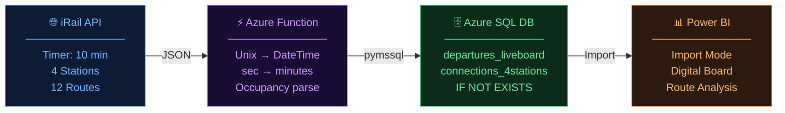

# 🚆 Belgian Rail: Azure Cloud Data Pipeline
**An End-to-End Serverless ETL Solution**

This project demonstrates a fully automated data pipeline built with **Microsoft Azure** and the **iRail API**. The system fetches, normalizes, and stores live Belgian train data into an **Azure SQL Database**, which is then visualized through a **Power BI dashboard**.

The primary focus of this project is to build a **serverless cloud architecture** to handle automated data ingestion and transformation for real-time analytics.

---

## 🏗️ System Architecture & Workflow

1. **Extract:** Azure Functions (Timer Trigger) fetch raw JSON data from the iRail API every 10 minutes.
2. **Transform:** A Python script processes the JSON, converts Unix timestamps to SQL-compatible DateTime, and handles data cleaning.
3. **Load:** Processed data is inserted into **Azure SQL Database** using the `pymssql` library.
4. **Visualize:** **Power BI** connects via **Import** to provide a real-time station "Digital Board" and route analysis.



---

## 📂 Repository Structure

```text
challenge-azure/
│
├── fetch_connection1/          # HTTP-triggered: Manual connection fetch
│   ├── __init__.py
│   └── function.json
│
├── fetch_connections_timer_v2/ # Timer-triggered: Automatic connection fetch
│   ├── __init__.py
│   └── function.json
│
├── fetch_liveboard/            # HTTP-triggered: Manual liveboard fetch
│   ├── __init__.py
│   └── function.json
│
├── fetch_liveboard_timer/      # Timer-triggered: Automatic liveboard fetch
│   ├── __init__.py
│   └── function.json
│
├── host.json                   # Azure Functions host configuration
├── local.settings.json         # Local env variables (Ignored by git)
└── images/                     # Screenshots and Deliverables
    ├── HTTP_function_test.png
    ├── SQL_data_table.png
    └── Power_BI_dashboard.png
```

---

## 📅 Project Timeline (4 Days)

| Day | Task | Milestone |
|-----|------|-----------|
| **Day 1** | API Exploration & Local Dev | Analyzed iRail API endpoints. Developed Python logic for Unix-to-DateTime conversion and JSON parsing. |
| **Day 2** | Azure SQL Setup | Provisioned Azure SQL Server and Database. Configured Firewall rules and established relational schemas. |
| **Day 3** | Cloud Deployment | Developed and deployed Functions via VS Code. Configured Azure App Settings for secure Connection String management. |
| **Day 4** | Data Visualization | Integrated Azure SQL with Power BI. Designed a digital board with real-time station filters (Slicers) for From-To routes. |

---

## 💾 Database Schema (SQL)

Run these scripts in your Azure SQL Query Editor to set up the environment:

### Table 1: `departures_liveboard` (Station Status)

```sql
CREATE TABLE departures_liveboard (
    id INT IDENTITY(1,1) PRIMARY KEY,
    station NVARCHAR(100),
    vehicle NVARCHAR(50),
    departure_time DATETIME,
    delay_minutes INT,
    is_canceled INT,
    created_at DATETIME DEFAULT GETDATE()
);
```

### Table 2: `departures_connections_4stations` (Route Tracking)

```sql
CREATE TABLE departures_connections_4stations (
    id INT IDENTITY(1,1) PRIMARY KEY,
    from_station NVARCHAR(100),
    to_station NVARCHAR(100),
    vehicle NVARCHAR(50),
    departure_time DATETIME,
    arrival_time DATETIME,
    duration_minutes INT,
    occupancy NVARCHAR(50),
    created_at DATETIME DEFAULT GETDATE()
);
```

---

## 🐍 ETL Logic (Python Step-by-Step)

The Python script inside the Azure Functions follows a strict **ETL (Extract, Transform, Load)** pattern:

### 📥 Ingestion (Extract)
- Uses the `requests` library to pull live JSON data from the iRail API.
- Fetches liveboard data for 4 stations: **Brussels-Central**, **Leuven**, **Gent-Sint-Pieters**, and **Antwerpen-Centraal**.
- Fetches connection data for all route combinations between the same 4 stations (12 routes total).

### 🔄 Transformation
- Uses `datetime.fromtimestamp()` to convert Unix epoch time to SQL-friendly format (`YYYY-MM-DD HH:MM:SS`).
- Converts `delay` and `duration` values from seconds to minutes (`// 60`).
- Extracts `is_canceled` status and `occupancy` level from the API response.

### 📤 Loading
- Opens a connection using `pymssql`.
- Uses `IF NOT EXISTS` duplicate check before every insert — same vehicle at the same departure time is never inserted twice.
- Executes **parameterized INSERT queries** to prevent SQL injection.
- Commits all changes to the Azure SQL Database after each run.

---

## ⚡ Key Features

| Feature | Description |
|---------|-------------|
| **Serverless Cost Optimization** | Uses Azure Functions Consumption Plan (Pay-as-you-go), charging only when the code runs. |
| **Dual Trigger System** | Supports both manual testing via HTTP requests and automated production scheduling via Timer Trigger. |
| **Cloud Security** | Database credentials and connection strings are managed via Azure Environment Variables, never hardcoded. |
| **Power BI Visualization** | Data is imported from Azure SQL into Power BI for station board and route analysis dashboards. |

---

## 👤 Author

**Esra Mogulkoc**

> 📄 *This project is for educational purposes as part of the BeCode Azure Challenge.*
